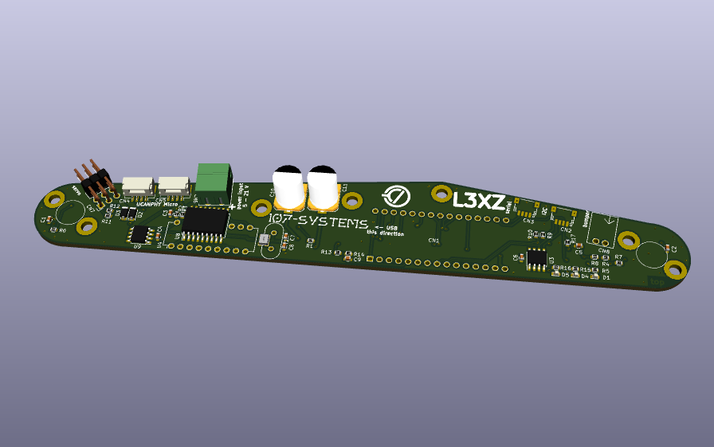
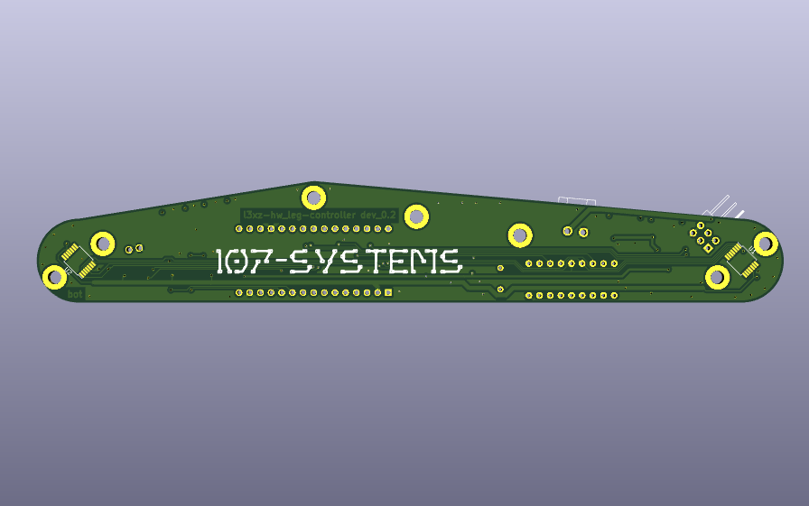

# l3xz-hw_leg-controller

leg controller for the [L3X-Z Hexapod](https://github.com/107-systems/l3xz-hw)



## pin usage

### Arduino Nano 33 IoT connector CN1

| **Pin** | **Pin Name** | **Signal**    | **Description**                  |
|:-------:|:------------:|:-------------:|:--------------------------------:|
| 1       | D13/SCK      | SPI_SCK       | SPI for CAN and AS5048 encoder   |
| 2       | +3V3         | 3V3-rail      | supply voltage for board         |
| 3       | AREF         |               |                                  |
| 4       | DAC0/A0      |               |                                  |
| 5       | A1           |               |                                  |
| 6       | A2           |               |                                  |
| 7       | A3           |               |                                  |
| 8       | A4/SDA       | I2C_SDA       | I2C for eeprom and qwiic         |
| 9       | A5/SCL       | I2C_SCL       | I2C for eeprom and qwiic         |
| 10      | A6           |               |                                  |
| 11      | A7           |               |                                  |
| 12      | VUSB/+5V0    |               |                                  |
| 13      | REC/RESET    | RESET         | Reset                            |
| 14      | GND          | GND           | chip select for BNO085           |
| 15      | VIN          | power input   | power input for board            |
| 16      | D1/TX        | SERIAL_TX     | to connector CN3                 |
| 17      | D0/RX        | SERIAL_RX     | to connector CN3                 |
| 18      | RESET        | RESET         | Reset                            |
| 19      | GND          | GND           | to sensors if SPI option is used |
| 20      | D2           | LED           | to sensors if I2C option is used |
| 21      | D3           | MCP2515_CS    | chip select for CAN              |
| 22      | D4           | AS5048_1_CS   | chip select for AS5048 1         |
| 23      | D5           | AS5048_2_CS   | chip select for AS5048 2         |
| 24      | D6           | BUMPER        | input for bumper                 |
| 25      | D7           | MCP2515_INT   | CAN interrupt                    |
| 26      | D8           |               |                                  |
| 27      | D9           | SERVO1        | PWM output for servo 1           |
| 28      | D10          | SERVO2        | PWM output for servo 2           |
| 29      | D11/MOSI     | SPI_MOSI      | SPI for CAN and AS5048 encoder   |
| 30      | D12/MISO     | SPI_MISO      | SPI for CAN and AS5048 encoder   |

### Qwiic I2C connector CN2

compatible to Sparkfun Qwiic. JST SH 1mm 4-pin.

| **Pin** | **Signal**    | **Description**                  |
|:-------:|:-------------:|:--------------------------------:|
| 1       | GND           |                                  |
| 2       | VCC           |                                  |
| 3       | I2C_SDA       |                                  |
| 4       | I2C_SCL       |                                  |

### serial connector CN3

JST SH 1mm 4-pin.

| **Pin** | **Signal**    | **Description**                  |
|:-------:|:-------------:|:--------------------------------:|
| 1       | GND           |                                  |
| 2       | VCC           |                                  |
| 3       | SERIAL_TX     |                                  |
| 4       | SERIAL_RX     |                                  |

### Dronecode CAN connector CN4 and CN5

JST GH 1.25mm 4-pin.

| **Pin** | **Signal**    | **Description**                  |
|:-------:|:-------------:|:--------------------------------:|
| 1       | CANVCC        |                                  |
| 2       | CANH          |                                  |
| 3       | CANL          |                                  |
| 4       | GND           |                                  |

### power input CN6

Würth WR-TBL 3.81mm 2-pin.

| **Pin** | **Signal**    | **Description**                  |
|:-------:|:-------------:|:--------------------------------:|
| 1       | V-IN          | directly to Arduino Nano VIN     |
| 2       | GND           |                                  |

Attention: V_IN is 5 to 21 V and is directly connected to VIN of the Arduino with a diode for reverse polarity protection.
It is also directly connected to +5V of the servo connector. So it should be limited to +6V if servos are used.

### servo connector CN7

pinheader 2.54mm 2x3-pin.

| **Pin** | **Signal**    | **Description**                  |
|:-------:|:-------------:|:--------------------------------:|
| 1+2     | servo-pwm     | 50 Hz pulse signal               |
| 3+4     | +5V           | directly connected to VIN        |
| 5+6     | GND           |                                  |

### bumper connector CN8

Würth WR-TBL 2.5mm 2-pin.

| **Pin** | **Signal**    | **Description**                  |
|:-------:|:-------------:|:--------------------------------:|
| 1       | BUMPER        | 10k pull up to +3.3V             |
| 2       | GND           |                                  |


## PCB

### Top


### Bottom




## spec

```
        |-- 6 x Leg Controller Board (Arduino Nano 33 IoT)
           |-- 2 x AS5048A rotary angle sensor for femur/tibia rotation
           |-- 1 x Screw terminals for ground contact bumper switch
           |-- 1-2 LEDs
           |-- MCP2515 for connectivity via UAVCAN
```
